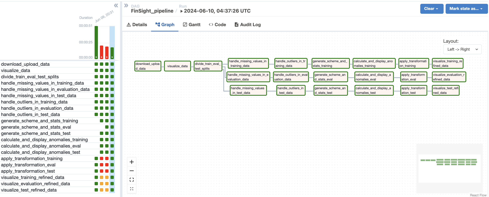
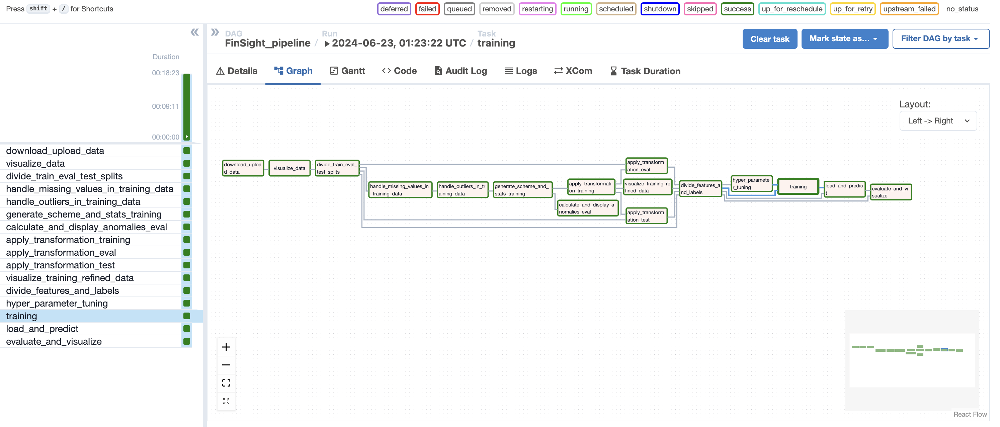
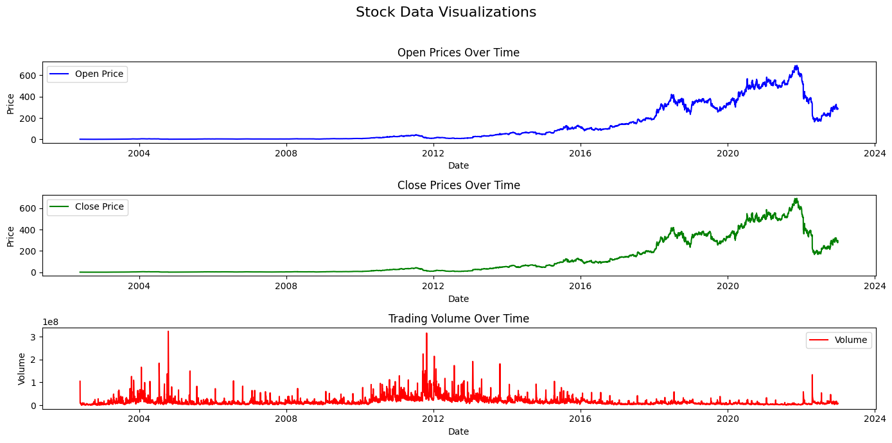
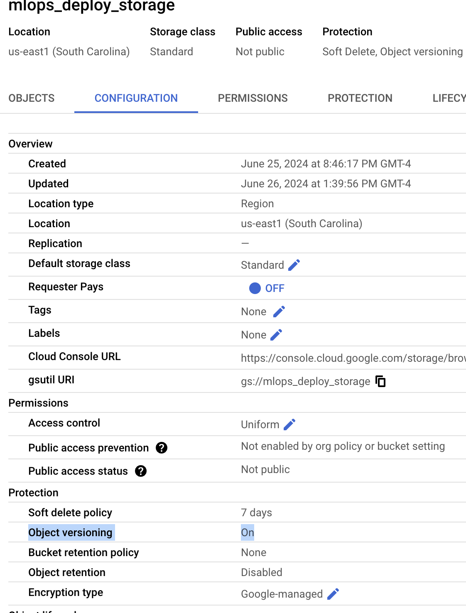
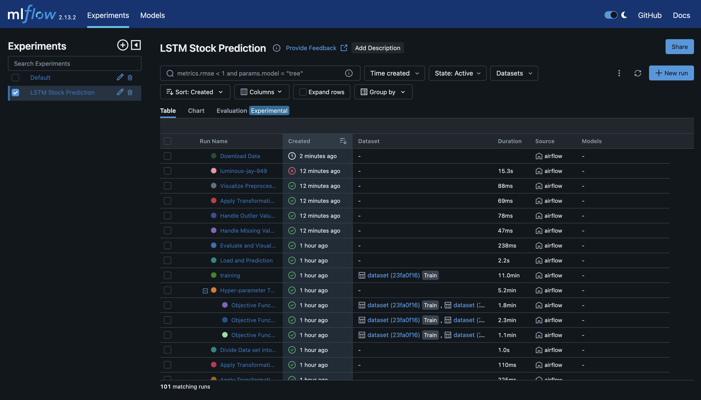
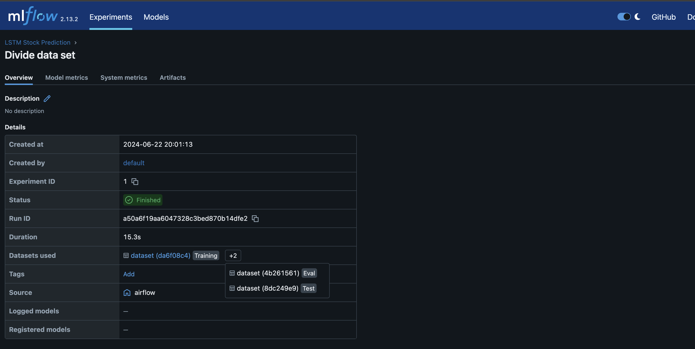
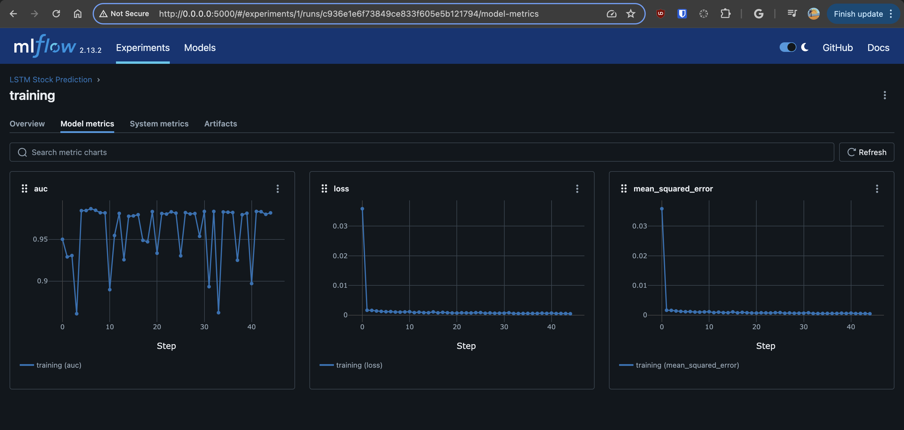
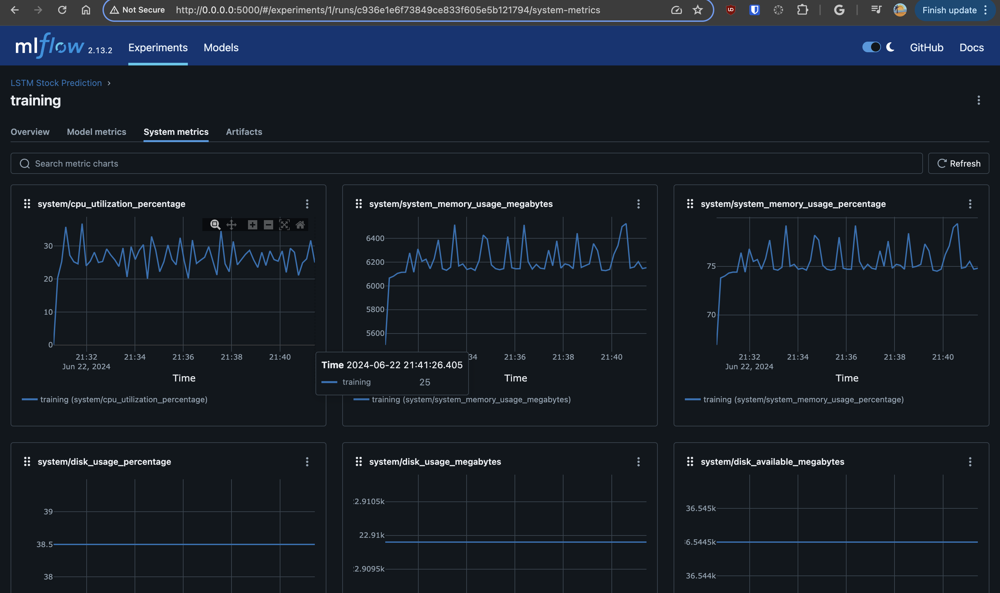
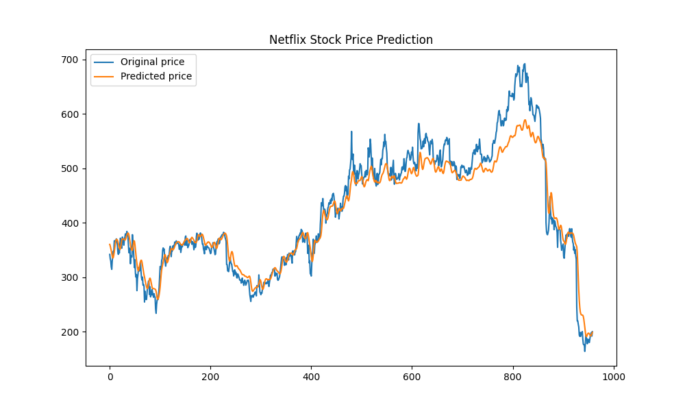
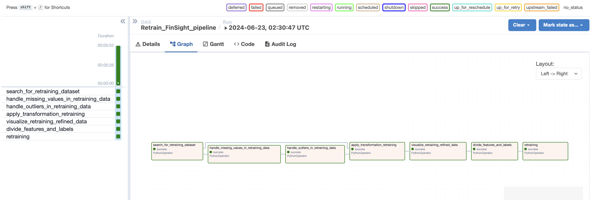

# FinSight
Adaptive Stock Prediction and Monitoring Pipeline

### Table of Contents
1. [Introduction](#introduction)
2. [Project Structure](#project-structure)
3. [Prerequisites](#prerequisites)
4. [Installation](#installation)
5. [Usage](#usage)
6. [Data Pipeline Workflow](#data-pipeline-workflow)
7. [Testing](#testing)
8. [Logging and Tracking](#logging-and-tracking)
9. [Data Version Control](#data-version-control)
10. [Pipeline Optimization](#pipeline-optimization)
11. [Schema and Statistics Generation](#schema-and-statistics-generation)
12. [Anomalies Detection and Alerts](#anomalies-detection-and-alerts)
13. [Dividing Feature and Labels](#dividing-feature-and-labels)
14. [Hyper Parameter Tuning](#hyper-parameter-tuning)
15. [Modelling & Training Phase](#training-phase)
16. [Load and Predict](#training-phase)
17. [Retraining DAG](#retraining-dag)
19. [Alert System](#retraining-dag)
<!-- 18. [Conclusion](#conclusion) -->

### Introduction
This project demonstrates a comprehensive pipeline for processing stock data and making a prediction. It includes data preprocessing, hyper-parameter tuning, modelling and training with MlFlow dashboards, evaluating and testing, workflow orchestration with Apache Airflow, data versioning with DVC, schema generation, and anomaly detection. The project is documented to ensure replication on other machines.

### Project Structure
This Project will be designed to be robust in both development and production setup. We Created 2 branches

1. ```dev``` for local development version with local storage & deployment
2. ```main``` for production ready version with Google storage & deployment lined with google cloud compute service.
3. Separated DAG tasks and its associated functions in 2 files namely ```finsight_pipeline_functions.py, finsight_pipeline_taks.py```

```
.
├── DAGs
│   └── FinSight
├── Dockerfile.airflow
├── Dockerfile.mlflow
├── Dockerfile.predict-endpoint-server
├── LICENSE
├── README.md
├── config
├── data
├── docker-compose.yaml
├── docs
├── images
│   ├── Test-Screenshot.png
│   ├── data-pipeline.png
│   └── dvc.png
├── logs
│   ├── dag_id=FinSight_pipeline
│   ├── dag_id=ReTrain_FinSight_pipeline
│   ├── dag_processor_manager
│   └── scheduler
├── mlruns
│   ├── artifacts
│   ├── mlflow.db
│   └── retraining-data
├── model
│   ├── best_stock_prediction.h5
│   ├── retrained_stock_prediction.h5
│   └── trained_stock_prediction.h5
├── plugins
│   └── best_stock_prediction.h5
├── requirements.txt
├── scoping
│   └── Finsight-scoping-doc-final.pdf
├── tests
├── visualizations
│   ├── prediction.png
│   ├── data1-viz.png
│   └── raw-data-viz.png
└── working_data

21 directories, 19 files
```

### Prerequisites
- Python 3.8+ (Packages like tensorflow, sklearn, keras, mlflow etc.)
- Apache Airflow 2.5+
- Google compute Engine
- Google Cloud SDK (for GCS integration)

### Installation
1. **Clone the repository:**
   ```bash
   git clone https://github.com/aditya-prayaga/FinSight.git
   cd FinSight
    ```
    **Note:** 
    1. If the user trying to install doesn't have airflow setup/docker setup done, please follow instructions in this [video](https://www.youtube.com/watch?v=exFSeGUbn4Q&t=511s&pp=ygUTcmFtaW4gYWlyZmxvdyBzZXR1cA%3D%3D)
    2. Please git check out ```dev``` branch to find additional files like ```docker-compose.yaml```, logs etc which help us in deploying the airflow and orchestrate.

2. When you are in the FinSight directory run the initial airflow set up command via running command ```docker compose up airflow-init```. With this we create a user(airflow2) and the initial Db migrations that are necessary

3. Lastly to make the web server up, please run ``` docker compose up```

### Usage

- We can access Web server after 3-5 mins of ```docker compose up``` command by visiting site: http://0.0.0.0:8080/home 

- Here we find our DAGS ```FinSight_pipeline```, ```Retrain_FinSight_pipeline``` pipelines. We can run (Click Play button) from here itself or click on the pipeline and run from there too.


### Data Pipeline Workflow

This is the initial Pipeline For which later Test tasks in airflow and Github action yml file would be added to make a seamless pipeline.



Here is an second version of the pipeline Data Pipieline we have Removed redundant Tasks Merged them with existing and erased unnecessary tasks.



### download_and_uploadToDVCBucket_task:

Purpose: Downloads the latest stock data from configured financial data APIs and uploads it to a DVC-managed bucket in Google Cloud Storage.

Data Handling: Ensures data integrity and version control right from the start of the pipeline.

### visualize_raw_data_task:

Purpose: Generates initial visualizations of the raw data to provide insights into its distribution and potential issues that may need addressing in preprocessing.

Tools Used: Python libraries such as Matplotlib or Seaborn are used for generating plots which are then logged or stored within the project's visualization directory.

Below is a Visualization Data



### divide_train_eval_test_splits_task:

Purpose: Splits the data into training, evaluation, and testing datasets to ensure a proper distribution for machine learning modeling.

Implementation: Typically involves random splits while ensuring a balanced representation of data characteristics across each set.

### handle_missing_values_task:

Purpose: Applies strategies to handle missing data, which may include imputation techniques or removal of rows/columns based on predefined thresholds.

Flexibility: Configurable to adapt different strategies based on the nature of the data and the predictive modeling requirements.

### handle_outliers_in_*_data_task (for each dataset split):

Purpose: Detects and handles outliers in the data which could potentially skew the results of the predictive models.

Techniques Used: May include statistical methods like Z-scores, IQR or domain-specific heuristics.

### generate_scheme_and_stats_*_task (for each dataset split):

Purpose: Generates a schema for the dataset and calculates statistics to understand the data’s underlying patterns and ensure it meets the expected formats and distributions.

Tools Used: TensorFlow Data Validation (TFDV) is commonly employed for this purpose, providing detailed reports and visualizations.

### calculate_and_display_anomalies_*_task (for each dataset split):

Purpose: Identifies any anomalies in the data sets using the schema and statistics generated in the previous steps.

Outcome: Anomalies are logged and visualized; alerts could be triggered based on the severity to ensure prompt attention by the data team.

### apply_transformation_*_task (for each dataset split):

Purpose: Applies necessary transformations to the data, which could include scaling, normalization, or feature engineering to enhance model performance.

Customization: Transformations are defined based on the predictive model requirements and the specific characteristics of the stock data.

### visualize_*_refined_data_task (for each dataset split):

Purpose: Provides visualizations of the processed data to confirm that the intended transformations have been applied correctly.

Review: These visualizations help in the qualitative review of the data before it is fed into machine learning models.


### Testing
1. **Running Tests:** Before running tests, ensure that all dependencies are installed. You can install them using ```pip install pytest, pytest_mock```.
To run the tests, execute the command pytest in the root directory of the project. This will discover and run all test cases in the project.

2. **Integration with Pipeline:** The tests are designed to validate the functionality of various components of the pipeline both positive and negative scenarios. When incorporating tests into the pipeline, they should be run as part of the CI/CD process, triggered automatically whenever changes are pushed to the repository. You can integrate the test suite with CI/CD pipeline using GitHub Actions.

3. **Handling Test Failures:** In the event of a test failure, the CI/CD system will detect the failure and halt the pipeline.
Depending on the CI/CD configuration, you can set up conditional triggers to perform specific actions when a test fails.
For example, if a test fails, you might want to stop the pipeline execution, notify relevant team members via email or messaging systems, or roll back changes if necessary.
Conditional triggering of tasks can be achieved by defining appropriate failure conditions in the CI/CD configuration file (e.g., .gitlab-ci.yml etc.). These conditions can specify actions to take when tests fail, such as skipping deployment steps or initiating remediation processes.

4. **Reporting Failure of Tasks:** In Docker compose up we have added application level reporting of the dag failure tasks. So when ever any dag fails an email is sent to prayaga.a@northeasten.edu email.

**Note:** Few of the test cases failed but as the time project progress more will be added and integrated in the pipeline. Below is the Current Test Functionality


### Logging and Tracking
- We used ```logging``` python package to log different level of information starting from INFO which is just printing to WARN, DEBUG, ERROR, etc.
- We use Exception handling to catch any errors and logged them as errors for better visibility in both airflow local and gcp cloud composer setup.
- We used **mlflow's logging mechanism** to log dataset versions & types, model analysis, system level metrics, etc parts of the pipeline.

### Data Version Control
- We handled data version controlling (DVC) by relying on the Google Cloud Storage Object Versioning for Production
-  We plan to programmatically tackle for local version controlling of data by enabling dvc init & Bash Operator in airflow.



- For Modelling we plan to use local folder and Mlflow's registry for storing model & would like to extend to Google cloud storage utilization.


### Pipeline Optimization
To ensure the efficiency and reliability of the pipeline, several optimization strategies can be applied:

1) Parallel Task Execution: Where possible, tasks should be executed in parallel to reduce the overall runtime of the pipeline. Airflow supports parallel task execution by defining independent tasks and setting appropriate dependencies.
2) Caching and Intermediate Storage: Use caching mechanisms and intermediate storage solutions to avoid redundant computations and data processing. This can significantly speed up the pipeline, especially when dealing with large datasets.
3) Error Handling: Implement robust error handling to ensure that transient issues do not cause the entire pipeline to fail. Configure tasks with appropriate retry policies and alerting systems.

### Schema and Statistics Generation

The generate_scheme_and_stats function is responsible for generating and validating the schema and statistics of the dataset. This process includes:

1) Schema Inference: Using TensorFlow Data Validation (TFDV) to infer the schema of the dataset, which includes data types, ranges, and distributions of features. This schema serves as a baseline for data quality checks.
2) Statistics Generation: Generating descriptive statistics from the dataset to provide insights into the distribution and characteristics of the data. These statistics are crucial for identifying anomalies and understanding data quality.
3) Schema and Statistics Visualization: Visualizing the schema and statistics to facilitate easy inspection and validation. This helps in quickly identifying any discrepancies or issues with the data.

~~~
# Schema
schema = tfdv.infer_schema(df)
tfdv.display_schema(schema)

# Stats
data_stats = tfdv.generate_statistics_from_dataframe(df)
tfdv.visualize_statistics(data_stats)

logging.info("Pushing data splits to XCom.")
ti.xcom_push(key='schema', value=schema)
ti.xcom_push(key='stats', value=data_stats)

~~~
**Note:** tfdv integration into airflow is troublesome the version of python with airflow docker image should match precisely with the tfdv 1.3.1 version.

Here is an open issue regarding tfdv, airflow & arm chip compatibility as discussed with TA's and Professor: https://github.com/tensorflow/tfx/issues/5804 

For v2: We have generated schema and stats from data like data type for schema and mean, sd, etc for Stats used this to evaluate evaluation data set  and calculate anomalies.

~~~
statistics = df.describe(include='all').transpose()

# Convert the DataFrame to a dictionary
statistics_dict = statistics.to_dict()
mlflow.log_param("Stats", statistics_dict)
~~~

### Anomalies Detection and Alerts

Detecting and managing anomalies in the data is critical to maintain the integrity and accuracy of the pipeline outputs. The calculate_and_display_anomalies function is designed to:

1. Anomaly Detection: Using the inferred schema and generated statistics, the function validates the data to detect any anomalies. These anomalies could be deviations from the expected data distribution, missing values, or outliers.
2. Anomaly Visualization: Displaying the detected anomalies helps in understanding the nature and extent of data issues. Visualization tools provided by TFDV are used to make this process intuitive.
3. Alerting Mechanism: Integrated Airflow with smtp server to mail prayaga.a@northeastern.edu if failed in any task.


```
schema = ti.xcom_pull(task_ids='generate_scheme_and_stats', key='schema')
statistics = ti.xcom_pull(task_ids='generate_scheme_and_stats', key='stats')
anomalies = tfdv.validate_statistics(statistics=statistics, schema=schema)
tfdv.display_anomalies(anomalies=anomalies)
```

For V2 We have taken below simple approach
~~~~
# Log the value s of training schema and stats for debugging purposes
logging.info(f"Training Schema: {training_schema}")
logging.info(f"Training Statistics: {training_stats}")

# Detect anomalies
anomalies = detect_anomalies(eval_df, training_schema, training_stats)
logging.info(f"Anomalies: {anomalies}")
~~~~


## Model Pipeline Overview

This project implements a comprehensive machine learning pipeline, integrating experimental tracking, model training, hyperparameter tuning, and model analysis. Key components of the project include:

- **Experimental Tracking Pipeline:** Utilizing MLflow to track experiments and log parameters, metrics, and models.

- **Model Lifecycle Management:** Managing the staging, production, and archiving of models using MLflow.
- **End-to-End Model Pipeline:** A robust pipeline that trains, saves, and performs hyperparameter tuning on the model. Also a separate Dag for retraining is also developed keeping in mind below reasons:
    - Why new dag: Because its coupling with the original pipeline. 
    - How?
        - Either it should be at start continuously checking for a retainable dataset (Unnecessary Compute) & may hinder process while found a retraining file while training.
        - Or it should be at the end connecting back in the dag which makes a cycle.
    - So we choose Separate dag but re-using the same functions.

- **Model Analysis:** Conducting model analysis, including data slicing, and generating efficacy and computational reports.


### Dividing Feature and Labels
This functionality is defined in the function divide_features_and_labels that separates data into features and labels for training, evaluation, and testing datasets. Here's a summary of the key points:


- **Data Slicing:** Analyzes the model's performance on different slices of data.
- It iterates over each DataFrame (train, eval, test).
For each DataFrame, it constructs the **feature** vectors from the previous 50 time steps and the corresponding **labels** from the current time step.
- The features & labels are logged as params in MlFlow
- The is also integrated exception handling intermediatory storage in XComArgs

### Hyper Parameter Tuning
- This section performs hyperparameter tuning using Optuna.
- Here defines an objective function to optimize various hyperparameters like units, number of layers, dropout rate, learning rate, and batch size. We can add epochs also if needed.
- The hyper_parameter_tuning function creates an Optuna study, optimizes the objective function over multiple **trials(Here we used 30)**, and logs the best hyperparameters using MLflow.
- Summarizing this Performs hyperparameter tuning to optimize the model. This step is part of the code but can be skipped during testing by retrieving .

### Modelling & Training Phase
- **Training Function:** The training function trains the model using the best hyperparameters obtained from hyperparameter tuning and trains model for around **45 epochs** and considering the evaluation to be using mean squared Error.


- **Model Creation and Compilation:** The model is created with the specified architecture and compiled with appropriate loss functions and metrics.
    - The Model is Decoupled from the Pipeline. So when ever there is new Model or system we can plug and play that model according to current pipeline requirements.
    - The distributed Structure help in distribute **MLOPS** tasks.
    - In this current project we use lstm Model from Keras.
    - Kera's Integration with MlFlow is used to log data sets, parameters, inputs, metrics
- **Training Process:** The model is trained on the provided training data and the training process is logged using MLflow.
- **Model Efficacy Report:** Generates reports on the model's efficacy and computational performance using MLFlow model metrics.



- **Visualization:** Utilizes tools like MlFlow to visualize the model's performance and other metrics.


- **Model Saving:** The trained model is saved to a specified path for future use.

### Load and Predict
 - We Use above Saved to predict and plot graph to compare and visualize the performance.





### Retraining DAG
The Retraining DAG orchestrates the process of retraining the FinSight pipeline using updated data. It involves a series of tasks including data ingestion, preprocessing, and retraining the model, managed by Apache Airflow.



Key Points:
- **Data Ingestion and Preprocessing:** The DAG continuously checks for new data files, reads them into dataframes, handles missing values, outliers, and applies necessary transformations.
- **Feature and Label Division:** The processed data is divided into features and labels, which are then used for retraining the model.
- **Model Retraining:** The model is retrained using the newly ingested and processed data, with parameters from previous training or tuning.
- **Task Dependencies:** The tasks are sequenced to ensure proper workflow, starting from data ingestion to retraining the model.
- **MLflow Integration:** Although not explicitly shown in the retraining tasks, MLflow can be integrated to log the parameters and metrics during the retraining process.
